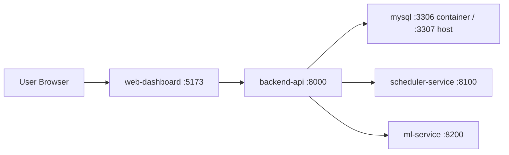

# OrdoStack Architecture

Issue 8 provides a local MVP architecture with MySQL-backed persistence for task data and generated schedules.

## Runtime Boundaries

- `backend-api` is the public API gateway for product features.
- `mysql` stores tasks, fixed events, execution logs, generated schedule runs, and generated schedule items for the local Docker MVP.
- `scheduler-service` owns scheduling algorithms.
- `ml-service` owns duration prediction behavior.
- `web-dashboard` is the browser-facing dashboard.

Later phases will add Alembic migrations, ClearML agent execution, DL service, CI/CD, and production reverse proxy wiring.
