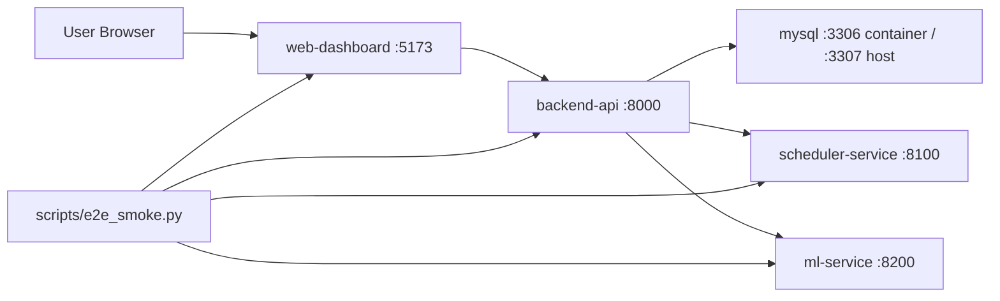

# OrdoStack Architecture

Issue 26 defines the current local Customer Demo MVP architecture. The system is runnable with Docker Compose and uses service boundaries that can later be hardened for production deployment.

## Runtime Boundaries

- `web-dashboard` is the browser-facing customer demo UI.
- `backend-api` is the public API gateway for product features.
- `backend-api` owns task, fixed event, execution log, analytics, schedule persistence, and demo reset workflows.
- `scheduler-service` owns scheduling algorithm internals and returns generated schedule blocks.
- `ml-service` owns duration prediction behavior and model metadata.
- `mysql` stores local Docker MVP data.
- `scripts/e2e_smoke.py` verifies the demo path after Docker Compose is running.

## Data Flow

1. The dashboard loads date-scoped tasks, fixed events, analytics, duration predictions, latest schedule, and schedule history from backend-api.
2. backend-api reads and writes product data through the configured store implementation.
3. In Docker, `DATA_STORE=mysql` persists data in MySQL.
4. During schedule generation, backend-api requests duration predictions from ml-service.
5. backend-api sends tasks, fixed events, and planning settings to scheduler-service.
6. scheduler-service returns generated timeline items and algorithm summary.
7. backend-api persists the generated schedule run and schedule items.
8. The dashboard can reload the latest schedule or switch to a recent schedule history item.

## Persistence

Docker Compose uses MySQL for:

- `tasks`
- `fixed_events`
- `execution_logs`
- `schedule_runs`
- `schedule_items`

Alembic migrations run before backend-api starts in Docker. The older automatic schema bootstrap remains as a non-destructive local compatibility fallback.

Local pytest runs use the in-memory store by default, so service tests do not require a running database.

## Quality Gates

Current local release gates:

- backend-api pytest suite.
- scheduler-service pytest suite.
- ml-service pytest suite.
- web-dashboard production build.
- Docker Compose config validation.
- Docker Compose rebuild and health checks.
- Local E2E smoke script.
- Browser screenshot smoke script.
- Secrets scan.

GitHub Actions currently runs test, build, and config checks. Docker runtime E2E is still local-only.

## Current Limitations

- No production auth or tenant isolation.
- No deployed production infrastructure.
- No ClearML agent or production model registry.
- No DL service.
- No mobile app implementation.
- No production backup, restore, monitoring, or incident workflow.
- Browser screenshot smoke exists, but no pixel-perfect visual regression suite exists yet.
