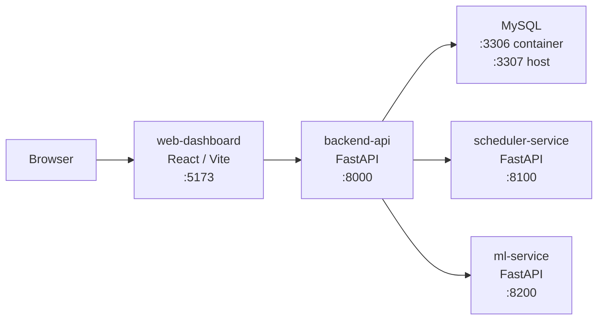
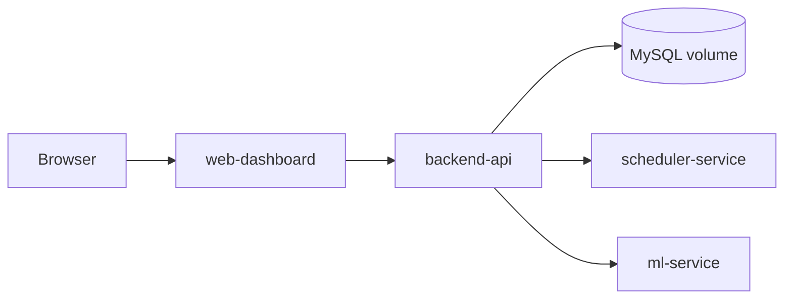
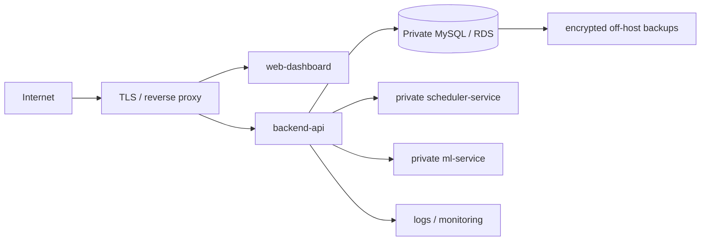

# Architecture

OrdoStack is a small service-oriented local application. The dashboard talks to one backend API. The backend owns product data and calls two internal services: one for scheduling and one for duration prediction.



## Runtime Boundaries

| Component | Responsibility |
| --- | --- |
| `web-dashboard` | Browser UI, task forms, schedule review, history controls, export actions, language switcher |
| `backend-api` | Auth, task data, fixed events, execution logs, analytics, schedule persistence, exports, demo reset |
| `scheduler-service` | Scheduling algorithms and timeline generation |
| `ml-service` | Local duration prediction and model metadata |
| `mysql` | Docker persistence for product data |

The backend is the only public product API. The dashboard does not call MySQL, scheduler-service, or ml-service directly.

## Repository Structure

```text
web-dashboard/       Browser client
backend-api/         Public product API and persistence owner
scheduler-service/   Stateless scheduling engine
ml-service/          Stateless local duration prediction
database/            Schema reference
scripts/             QA, smoke, backup, and verification commands
infra/               Reverse-proxy configuration
docs/                Product, operations, security, and release documents
```

There is no shared application framework between services. Each service owns a small HTTP boundary and can be tested independently.

## Data Flow

1. The dashboard loads tasks, fixed events, analytics, duration predictions, latest schedule, and schedule history for the selected date.
2. `backend-api` reads and writes through its repository layer.
3. In Docker, the repository layer uses MySQL. In tests, it uses the in-memory store.
4. When the user generates a plan, `backend-api` requests duration predictions from `ml-service`.
5. `backend-api` sends tasks, fixed events, and planning settings to `scheduler-service`.
6. `scheduler-service` returns schedule items and an algorithm summary.
7. `backend-api` saves the generated run and schedule items.
8. The dashboard can reload, rename, compare, lock, move, or export saved schedule runs.

## Scheduling

The scheduler service keeps planning logic out of backend routes. Current algorithms are intentionally small and readable:

- priority scoring for task value,
- topological sorting for dependencies,
- capacity selection for tasks that fit available time,
- priority-queue ordering,
- free-slot construction around fixed events,
- locked-item preservation for manually adjusted schedules.

The scheduler returns a generated timeline. It does not persist data.

## Duration Prediction

`ml-service` predicts task duration from:

- estimated minutes,
- category,
- priority,
- difficulty,
- focus requirement,
- actual minutes when available.

Feature definitions, valid ranges, excluded (leakage/PII) fields, and the one-hot encoding are owned by a single data contract module (`ml-service/app/data_contract.py`, schema `1.0.0`) shared by training and serving, so the two sides cannot drift apart.

The service first looks for the model referenced by the local JSON registry (`model_registry.json`), then the default artifact, and falls back to a deterministic heuristic when the artifact is missing, corrupted, or from an incompatible schema major version. Two artifact types are servable without scikit-learn at runtime: the multiplier table (current production) and `linear-json` (StandardScaler + linear coefficients exported as plain JSON; a parity test pins it to the fitted sklearn pipeline within 0.01 minutes). No paid API or hosted model endpoint is required.

The retraining loop is local and metrics-gated:

1. `scripts/export_duration_feedback.py` pulls completed-task feedback from `backend-api`.
2. `ml-service/training/validate_dataset.py` checks the CSV against the data contract (types, ranges, duplicates, outlier ratios) and writes a report; trainers refuse contract-violating data.
3. `ml-service/training/train_duration_model.py` (multiplier table) and `training/train_linear_model.py` (ridge / elastic-net, JSON-exported) retrain with a seeded holdout split and report out-of-sample MAE, Median AE, and RMSE against the naive-estimate baseline. Artifacts carry schema version, feature names, dataset checksum, source commit, library versions, and prediction bounds.
4. `ml-service/training/promote_duration_model.py` promotes a candidate only through three gates: an evidence gate (at least 10 out-of-sample evaluation rows, otherwise it reports `insufficient evidence for automatic promotion`), a baseline gate, and an active-model regression gate. It supports `--dry-run`, writes the registry atomically, and appends every decision to `promotion_audit.jsonl`.
5. `POST /model/reload` serves the promoted artifact without a restart; `training/rollback_duration_model.py` restores a previous version after verifying its artifact.

Every generated plan logs its served predictions; completed tasks pair actual minutes back into those logs, and `GET /api/ml/prediction-accuracy` reports rolling model-vs-estimate MAE plus a `sufficient_data` verdict (below 10 paired samples the dashboard shows "insufficient samples" instead of a percentage). Predictions expose an honest uncertainty surface: a historical error band (`lower_bound`/`upper_bound`), a `reliability` label, per-category `sample_count`, an `out_of_distribution` flag for unseen categories or extreme estimates, and per-factor contributions (`factors`) that reconstruct the prediction. The legacy `confidence` score is kept for backward compatibility and is documented as rule-derived, not a calibrated probability. Served predictions apply a per-user calibration factor computed from that user's paired prediction history (raw model outputs are logged separately so the factor cannot feed back on itself). `training/compare_models.py` records a cross-validated comparison of six candidates (naive estimate, DummyRegressor, multiplier table, ridge, elastic-net, gradient boosting). Training and promotion optionally record tasks, metrics, and artifacts to ClearML (`ORDOSTACK_CLEARML_ENABLED=1`, offline-capable, never blocking the loop); see [clearml/README.md](clearml/README.md).

ML documentation lives in `docs/ml/`: [ML_SYSTEM_AUDIT.md](docs/ml/ML_SYSTEM_AUDIT.md), [DATA_CARD.md](docs/ml/DATA_CARD.md), [MODEL_CARD.md](docs/ml/MODEL_CARD.md), [EXPERIMENT_REPORT.md](docs/ml/EXPERIMENT_REPORT.md), [MLOPS_RUNBOOK.md](docs/ml/MLOPS_RUNBOOK.md), and [FUTURE_ML_ROADMAP.md](docs/ml/FUTURE_ML_ROADMAP.md).

## Persistence

Docker Compose uses MySQL for:

- users,
- tasks,
- fixed events,
- execution logs,
- schedule runs,
- schedule items,
- schedule templates.

Alembic migrations run before `backend-api` starts in Docker. The older schema bootstrap remains only as a local compatibility fallback.

## Failure Modes

| Failure | Product behavior | Recovery boundary |
| --- | --- | --- |
| `ml-service` unavailable | Backend uses task estimates as the duration fallback | Restore ML service; no product data repair required |
| `scheduler-service` unavailable | Schedule generation returns `503`; existing tasks and saved schedules remain available | Restore scheduler service and retry generation |
| MySQL unavailable | Persistent product requests fail; health remains process-only and readiness must be checked | Restore MySQL before accepting writes |
| Dashboard unavailable | API and stored data remain intact | Restore or replace the stateless dashboard container |
| Migration failure | Backend container does not start | Fix forward or restore an approved backup; do not silently downgrade |
| Invalid production configuration | Backend startup or readiness fails | Correct external environment values and restart |

## Deployment Topology

Local and CI runtime:



Hosted beta target:



Only the dashboard and backend API may be public. Internal services and MySQL must not expose public ports in a hosted environment.

## Security Boundaries

- `backend-api` authenticates users and scopes planner data by user.
- Production rejects the local auth secret and disables demo reset.
- Secrets remain external to images and Git.
- Request logs exclude bodies, authorization headers, cookies, and query strings.
- Hosted TLS, secret storage, rate limiting, and account recovery remain deployment gates.

## Quality Gates

Local verification is split into two levels.

Fast gate:

```powershell
python scripts\ponytail.py --include-compose-config
```

Runtime gate:

```powershell
docker compose up --build -d
python scripts\e2e_smoke.py
python scripts\browser_smoke.py
```

The runtime gate checks the full path through dashboard, backend, scheduler, ml-service, and MySQL.

GitHub Actions also runs the stack from a clean checkout and verifies migrations, E2E, browser rendering, MySQL restart persistence, backup integrity, and restore into a temporary database.

## Current Limits

- No hosted infrastructure is included.
- No production secret store is configured.
- No off-host backup destination is wired.
- No external monitoring vendor is configured.
- No production ML model registry or ClearML agent is running.
- The mobile app folder is not an implemented mobile client.
