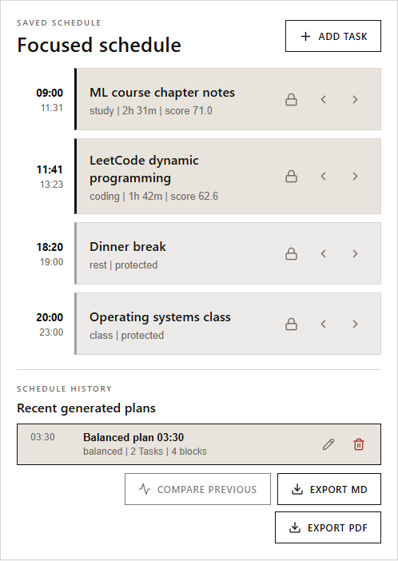
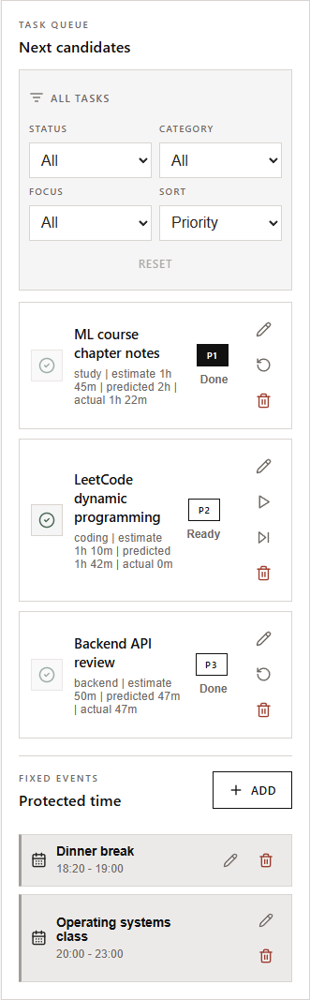
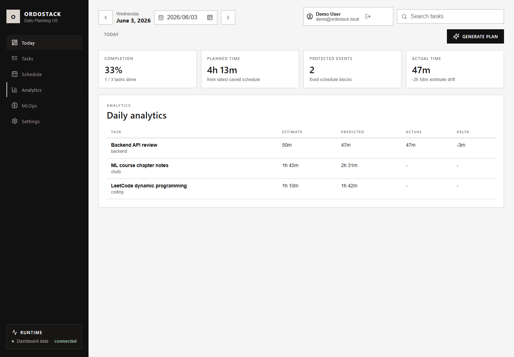

# OrdoStack

OrdoStack is a local-first daily planner. It combines tasks, fixed events, execution logs, schedule generation, and duration prediction into one workflow: plan the day, adjust the schedule, run the work, then compare estimates with reality.

The repository is currently a local Private Beta Candidate. It runs with Docker Compose, does not use paid APIs, and is not a hosted production service.


*The dashboard after one click on Generate Plan: scored task blocks scheduled around protected events, daily KPIs, ML duration predictions, and the plan-quality panel.*

## Problem

Most planning tools keep a list. A list is useful, but it does not answer the harder questions:

- Where does this task fit around meetings or fixed commitments?
- Which tasks should fit into the remaining day?
- How far off were the original estimates?
- Can the generated plan be saved, edited, compared, and exported?

OrdoStack focuses on that loop for one day at a time.

## What Works Today

- Local account registration, demo login, bearer-token auth, password policy, and login lockout.
- Date-scoped tasks with create, edit, status changes, reopen, and soft delete.
- Fixed events with create, edit, soft delete, and weekly recurrence expansion.
- Schedule generation through a dedicated scheduler service.
- Schedule history with rename, compare, export, lock, and manual time adjustment.
- Local schedule exports in Markdown, CSV, and PDF.
- Execution logs and daily analytics: actual minutes, estimate drift, completion rate, focus minutes, and forecast.
- Local duration prediction through `ml-service` using a JSON artifact or heuristic fallback.
- Workspace views for planning, task management, schedule review, analytics, prediction insight, and settings.
- English UI by default, with Traditional Chinese available in the dashboard.
- Local retraining loop: export execution feedback, retrain with holdout evaluation, metrics-gated model promotion, hot reload.
- Docker Compose runtime with MySQL persistence.
- Local QA gates for tests, build, security, accessibility, backup policy, visual regression, and smoke checks.
- Clean-checkout Docker runtime CI covering migrations, E2E, persistence across MySQL restart, backup verification, and isolated restore.

## Interface

**Focused schedule and history.** The timeline shows scheduler-scored blocks around protected events, with per-item lock and 15-minute move controls, saved-plan history, compare, and Markdown/PDF export.



**Task queue with ML predictions.** The task queue shows each task's estimate next to the ML-predicted duration and the actual logged minutes, with start/pause/complete/skip execution controls.



The sidebar switches between six workspace views. Analytics compares estimated, predicted, and actual minutes per task; MLOps shows the active prediction model and per-task confidence; Settings holds account, language, and shortcut reference.



Keyboard shortcuts: `Alt+←` / `Alt+→` switch days, `Alt+T` jumps to today, `Alt+G` generates a plan.

## Quick Start

### Requirements

| Requirement | Version | Needed for |
| --- | --- | --- |
| Docker Desktop with Docker Compose | current | Running the full stack (only hard requirement) |
| Python | 3.11+ | Local QA scripts and ML training tools |
| Node.js | 20+ | Only when running `web-dashboard` outside Docker |
| Edge or Chrome | any recent | Only for browser smoke and screenshot scripts |

No cloud account, API key, or paid service is needed. Everything runs on `localhost`.

### 1. Clone and start

Windows PowerShell:

```powershell
git clone https://github.com/cdexswzaq0110/Ordostack.git
cd Ordostack
docker compose up --build -d
```

Linux / WSL:

```bash
git clone https://github.com/cdexswzaq0110/Ordostack.git
cd Ordostack
docker compose up --build -d
```

The first build takes a few minutes. When it finishes, `docker compose ps` should show five services (`backend-api`, `scheduler-service`, `ml-service`, `mysql`, `web-dashboard`) with status `healthy`. Database migrations run automatically before `backend-api` starts.

### 2. Sign in

Open:

```text
http://localhost:5173
```

Sign in with the demo account (prefilled in the login form):

```text
demo@ordostack.local
ordostack-demo
```

The dashboard opens on the bundled demo dataset date (2026-06-03) with seeded tasks and fixed events. Click **Generate Plan** (or press `Alt+G`) to produce the schedule shown in the screenshots above. Use **Reset demo** in the Settings view to restore the seed data at any time.

### 3. Stop

```powershell
docker compose down
```

Data persists in the `ordostack_mysql_data` Docker volume across restarts.

### Troubleshooting

- **A port is already in use** — the stack needs 5173, 8000, 8100, 8200, and 3307 on the host. Stop the conflicting process or adjust `docker-compose.yml` and the health checks together.
- **`web-dashboard` is unhealthy on first start** — it waits for `backend-api`, which waits for MySQL to pass its health check; give the first boot up to a minute, then check `docker compose logs backend-api`.
- **Docker is not running** — start Docker Desktop first; `docker info` should print a server version.

## Health Checks

| Service | URL |
| --- | --- |
| Dashboard | `http://localhost:5173` |
| backend-api | `http://localhost:8000/api/health` |
| scheduler-service | `http://localhost:8100/health` |
| ml-service | `http://localhost:8200/health` |

Readiness:

| Service | URL |
| --- | --- |
| backend-api | `http://localhost:8000/api/ready` |
| scheduler-service | `http://localhost:8100/ready` |
| ml-service | `http://localhost:8200/ready` |

## Architecture

```text
Browser
  |
  v
web-dashboard :5173
  |
  v
backend-api :8000
  |-- MySQL :3306 container / :3307 host
  |-- scheduler-service :8100
  `-- ml-service :8200
```

`backend-api` is the product API. It owns authentication, tasks, fixed events, execution logs, analytics, schedule persistence, schedule export, and demo reset.

`scheduler-service` owns scheduling logic. It scores tasks, respects dependencies, selects work that fits into available time, builds free slots around fixed events, and returns timeline items.

`ml-service` owns duration prediction. It uses a local JSON model artifact when available and falls back to a deterministic heuristic when the artifact is missing.

`mysql` stores local Docker data: users, tasks, fixed events, execution logs, schedule runs, schedule items, and schedule templates.

## Clean Check

Run before committing:

```powershell
python scripts\ponytail.py --include-compose-config
```

The gate runs documentation completeness, service tests, dashboard build, security audit, accessibility audit, backup policy audit, beta readiness check, translation coverage, visual regression when artifacts exist, Git whitespace checks, and Docker Compose config validation.

For runtime verification, run:

```powershell
docker compose up --build -d
python scripts\e2e_smoke.py
python scripts\browser_smoke.py
```

## Documentation Map

Start here:

| Topic | File |
| --- | --- |
| Product scope | [ORDOSTACK_PROJECT_SPEC.md](ORDOSTACK_PROJECT_SPEC.md) |
| System architecture | [ARCHITECTURE.md](ARCHITECTURE.md) |
| API behavior | [docs/api.md](docs/api.md) |
| QA workflow | [docs/qa-mvp.md](docs/qa-mvp.md) |
| Test report (v0.53.0) | [docs/test-report.md](docs/test-report.md) |
| Release process | [docs/release-process.md](docs/release-process.md) |
| Environment variables | [docs/environment.md](docs/environment.md) |
| Backup and restore | [docs/backup-restore.md](docs/backup-restore.md) |
| Architecture decisions | [docs/adr/README.md](docs/adr/README.md) |
| Product roadmap | [docs/product-roadmap.md](docs/product-roadmap.md) |
| AWS deployment plan | [docs/aws-deployment-plan.md](docs/aws-deployment-plan.md) |
| ClearML MLOps plan | [docs/mlops-clearml-plan.md](docs/mlops-clearml-plan.md) |
| Security checklist | [docs/security-checklist.md](docs/security-checklist.md) |

Repository maintenance:

| Topic | File |
| --- | --- |
| Contributing | [CONTRIBUTING.md](CONTRIBUTING.md) |
| Security | [SECURITY.md](SECURITY.md) |
| Support | [SUPPORT.md](SUPPORT.md) |
| Changelog | [CHANGELOG.md](CHANGELOG.md) |

The remaining files under `docs/` are supporting runbooks and historical notes. They are useful for QA and release review, but not required for a first read.

## Current Limits

- Not a hosted SaaS launch.
- No AWS resources, DNS, TLS certificate, paid API, or external monitoring vendor is provisioned by this repository.
- The mobile app folder is a placeholder, not a shipped mobile client.
- ClearML and production model governance are documented but not operational.
- Production secrets must stay outside Git.
