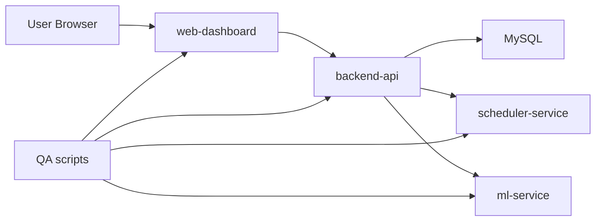

# System Analysis

OrdoStack is built around a simple planning loop: write down the work, protect the time that cannot move, generate the day, adjust the plan, then compare the result with what actually happened.

## Problem

Static task lists are easy to create and hard to trust. They rarely account for meetings, recurring obligations, dependencies, or the fact that a 30-minute task often takes 50 minutes in practice.

The MVP solves the first version of that problem. It turns tasks and fixed events into a dated schedule, then gives the user enough control to lock, move, execute, and export that schedule.

## Actors

| Actor | Goal |
| --- | --- |
| Planner user | Create tasks, protect fixed time, generate a daily plan, execute work, and review outcomes |
| QA engineer | Verify local demo flows, API behavior, schedule generation, language support, export, and clean gates |
| PM / product owner | Review readiness, launch boundaries, and customer-demo scope |
| Developer | Maintain services, tests, migrations, documentation, and release gates |
| Future operator | Run Docker deployment, configure secrets, watch health checks, and manage backup procedures |

## Functional Scope

The current product covers:

- Local account registration and login.
- Task and fixed-event management.
- Weekly recurrence expansion for fixed events.
- Date-scoped schedule generation.
- Schedule persistence, history, comparison, lock, and manual adjustment.
- Execution logging and daily analytics.
- Local duration prediction through `ml-service`.
- Markdown, CSV, and PDF export.
- English and Traditional Chinese dashboard copy.
- Demo data reset for the bundled local demo user.

## Non-Functional Scope

- No paid API is required.
- Docker Compose is the supported local runtime.
- Tests use in-memory repositories where possible.
- MySQL is used for Docker persistence.
- Production secrets stay outside Git.
- Destructive restore into an active database is not automated.
- Hosted deployment, DNS, TLS, off-host backup, and monitoring vendor setup require later account decisions.

## System Context

## Data Ownership

| Data | Owner | Storage |
| --- | --- | --- |
| Users | backend-api | MySQL in Docker, memory in tests |
| Tasks | backend-api | MySQL in Docker, memory in tests |
| Fixed events | backend-api | MySQL in Docker, memory in tests |
| Execution logs | backend-api | MySQL in Docker, memory in tests |
| Schedule runs | backend-api | MySQL in Docker, memory in tests |
| Schedule items | backend-api | MySQL in Docker, memory in tests |
| Schedule templates | backend-api | MySQL in Docker, memory in tests |
| Generated schedule candidate output | scheduler-service | Returned to backend-api |
| Duration prediction metadata | ml-service | Local JSON artifact or heuristic fallback |

## Acceptance Baseline

The acceptance baseline is:

- `docker compose up --build` starts the local stack.
- Health endpoints respond for backend-api, scheduler-service, ml-service, and web-dashboard.
- README explains how to run the project.
- QA plan exists in `docs/qa-mvp.md`.
- System design exists in `ARCHITECTURE.md` and this file.
- API behavior is documented in `docs/api.md`.
- Release process is documented in `docs/release-process.md`.
- Clean checks run through `python scripts/ponytail.py`.

## Out Of Scope For Current Repository State

- Public SaaS launch without external hosting decisions.
- Native mobile app implementation.
- ClearML hosted agent execution.
- Production ML model promotion workflow.
- Payment, multi-tenant enterprise permissions, and full account recovery.
- Automated restore into the active production database.
