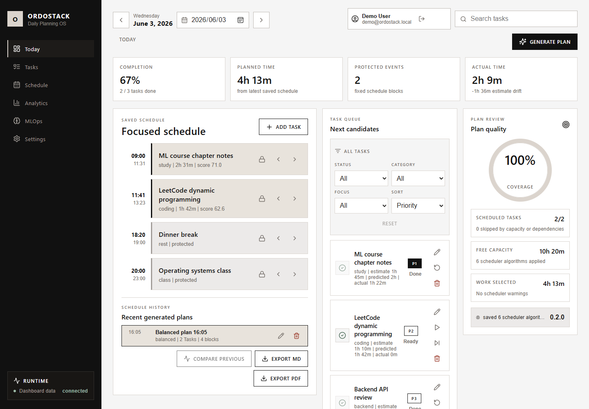

# OrdoStack 測試報告（v0.54.0）

> **日期:** 2026-07-10
> **版本:** 0.54.0（branch `feature/clearml-tracking`）
> **測試環境:** Windows 10 Pro、Docker Desktop（Engine 29.4.3）、Python 3.11（專案 `.venv`）、Node.js 20、Microsoft Edge（headless smoke）
> **結論:** ✅ 全數通過 —— 97 個單元/整合測試、11 項靜態閘門、Docker runtime 驗證（5 容器 healthy + E2E + browser smoke + 視覺回歸）

## 1. 測試範圍

本報告涵蓋 v0.52.0–v0.54.0 的完整驗證：三個後端服務的測試套件、dashboard build、八項靜態稽核、Docker Compose runtime 全鏈路驗證，以及兩版新增功能的實測——ML 重訓迴路（0.52.0）、介面重設計與側邊欄視圖導覽（0.53.0）、選配 ClearML 整合（0.54.0）。

## 2. 單元 / 整合測試

| 服務 | 測試數 | 結果 | 執行時間 | 重點涵蓋 |
| --- | ---: | --- | ---: | --- |
| backend-api | 60 | ✅ 全過 | 6.12s | auth（註冊/登入/鎖定）、tasks、fixed events、execution logs、analytics、schedule 持久化/diff/export、demo reset 與生產環境防護、migration guard |
| scheduler-service | 11 | ✅ 全過 | 0.39s | 優先級評分、拓撲排序、容量選擇、free-slot 建構、鎖定項保留 |
| ml-service | 26 | ✅ 全過 | 0.75s | 預測（artifact/heuristic/registry 三路徑）、**holdout 訓練指標、回饋合併、訓練決定性、晉升閘門（通過/拒絕基線/拒絕退步/回滾覆寫/歸檔）、熱載入、ClearML 追蹤（停用預設/追蹤內容/失敗安全/註冊回退/空回饋檔）** |
| **合計** | **97** | ✅ | | |

ml-service 測試由 11 個（0.51.x）擴充至 26 個。

執行指令（Windows PowerShell，各服務目錄下）：

```powershell
..\.venv\Scripts\python.exe -m pytest tests -q
```

## 3. 靜態品質閘門（ponytail）

```powershell
python scripts\ponytail.py --include-compose-config
```

| 閘門 | 結果 | 備註 |
| --- | --- | --- |
| backend-api / scheduler / ml-service tests | ✅ | 同上表 |
| web-dashboard build（tsc + vite） | ✅ | 216.61 kB JS（gzip 64.86 kB）＋ 22.97 kB CSS |
| a11y static audit | ✅ | focus-visible 與 ARIA 標籤檢查 |
| security audit | ✅ | 含 0.52.0 修正的金鑰誤判（`task-assignment-*` 檔名不再誤報） |
| documentation completeness | ✅ | 10 份 launch-facing 文件必要章節齊備 |
| backup policy audit | ✅ | |
| beta readiness check | ✅ | |
| translation coverage | ✅ | 234 keys（0.53.0 +31：視圖標題、分析表頭、設定頁、預覽提示，以及自 main 合入的操作成功提示與執行狀態文案） |
| visual regression | ✅ | 重設計屬預期變更，基線經人工檢視後重建；合併 main 後 diff 0.14% |
| git whitespace check | ✅ | |
| docker compose config | ✅ | |

## 4. Docker Runtime 驗證

```powershell
docker compose up --build -d
python scripts\e2e_smoke.py
python scripts\browser_smoke.py
```

| 項目 | 結果 | 證據 |
| --- | --- | --- |
| 容器健康（5/5） | ✅ | backend-api、scheduler-service、ml-service、mysql、web-dashboard 皆 `healthy` |
| E2E smoke | ✅ | 建立/編輯任務與固定行程、產生排程、改名、比較、匯出全鏈路 |
| Browser smoke | ✅ | Edge headless 載入重設計後 dashboard，截圖 106 KB |
| 視覺回歸 | ✅ | 1440×1000 新基線比對，diff 0.0（閾值 1%） |

實際登入畫面（demo 帳號、2026-06-03 示範資料集、已生成排程、v0.53.0 重設計）：



## 5. 本版新功能實測

### 5.1 ML 重訓迴路（train → gate → promote → reload）

| 步驟 | 指令 | 實測結果 |
| --- | --- | --- |
| 回饋匯出 | `python scripts\export_duration_feedback.py --days 7` | ✅ 管道打通（近 7 天無已完成任務故 0 列，屬預期） |
| 訓練 | `python ml-service\training\train_duration_model.py` | ✅ holdout MAE **4.33 分** vs 天真基線 **7.33 分**（improvement 41%、seed 42、11 train / 3 eval） |
| 晉升 | `python ml-service\training\promote_duration_model.py` | ✅ 閘門通過，registry 寫入版本化 artifact `duration_model-0.2.0-*.json` |
| 熱載入 | `POST http://localhost:8200/model/reload` | ✅ 回傳 `{"status":"reloaded","model_version":"0.2.0"}`，`/model/info` 即時反映，無需重啟容器 |

注意：訓練資料僅 14 筆種子資料，上述 MAE 證明**管線正確**，不代表模型品質；真實品質評估需累積 Beta 用戶回饋後進行（見 docs/internal/mlops-production-roadmap.md）。

### 5.2 前端 UX P0（0.52.0）

| 項目 | 驗證方式 | 結果 |
| --- | --- | --- |
| 任務/固定行程刪除確認 | 手動 + build | ✅ 點刪除跳出確認，取消不動作 |
| 誠實 model panel | runtime 截圖 | ✅ 顯示真實模型 `local-duration-regressor 0.2.0` 與演算法數（見上圖右下） |
| 「現在」時段高亮 + Now 標籤 | 程式邏輯 + build | ✅ 僅在檢視含當前時間的排程區塊時出現，每分鐘更新 |
| 快捷鍵 Alt+←/→/T/G | 手動 | ✅ 輸入框聚焦時不觸發；Generate 遵循原 disabled 條件 |

### 5.3 介面重設計與視圖導覽（0.53.0）

| 項目 | 驗證方式 | 結果 |
| --- | --- | --- |
| 側邊欄六視圖切換（Today/Tasks/Schedule/Analytics/MLOps/Settings） | Playwright DOM 檢查 | ✅ 點擊後 `nav-item active` class 僅存在於當前視圖，各視圖內容正確渲染 |
| Analytics 視圖（估時/預測/實際/差異表） | runtime 截圖 `docs/images/analytics-view.png` | ✅ 顯示真實資料（例：Backend API review 估 50m／預測 47m／實際 47m／差異 -3m） |
| MLOps 視圖（模型徽章、逐任務信心度） | 手動 | ✅ 顯示 `local-duration-regressor 0.2.0` 與 fallback 說明 |
| Settings 視圖（帳號、語言、快捷鍵、示範資料重置） | 手動 | ✅ 語言切換與示範重置自此視圖操作正常 |
| 真實排程涵蓋率取代拼湊分數 | 程式邏輯 | ✅ 環形顯示 scheduled/selected 比例（demo 資料為 100%） |
| 死按鈕清除（通知、command palette、more-options） | 原始碼檢查 | ✅ 已移除，無 `disabled` 裝飾按鈕 |
| 未排程預覽標示 | 程式邏輯 | ✅ 無排程時 timeline 顯示預覽提示文字 |
| 編輯風設計系統（ink/warm/canvas、方角、髮絲線） | 截圖人工檢視 + 視覺基線重建 | ✅ 全介面一致套用 CSS variables |

### 5.4 main 分支整合（v0.52.0 私測基線合入）

| 項目 | 驗證方式 | 結果 |
| --- | --- | --- |
| 操作成功提示（aria-live success banner，任務/行程/排程/匯出/重置全操作） | 移植後 build + runtime | ✅ |
| 可觀測儀表板狀態（connected / checking / needs attention / sign in） | 移植後 build | ✅ 取代寫死的服務 ok 清單 |
| demo-reset 生產環境防護 | backend 回歸測試 | ✅ 測試數 59→60 |
| 合併後全鏈路 | Docker rebuild + E2E + browser smoke | ✅ |

### 5.5 選配 ClearML 整合（0.54.0）

| 項目 | 驗證方式 | 結果 |
| --- | --- | --- |
| 預設停用 | 單元測試 + 全閘門於未設定環境下執行 | ✅ 無 ClearML 套件/憑證/伺服器時迴路完全不受影響 |
| 訓練追蹤（參數/指標/artifacts/資料集） | 真實 SDK（clearml 1.18.0）離線模式實跑 | ✅ offline session 內含 task 參數 5 項與 4 個 artifacts |
| 晉升註冊 | 真實 SDK 離線模式實跑 | ✅ 回傳 task id；OutputModel 離線不支援時自動回退為 task artifact |
| 失敗安全 | 單元測試（Task.init 拋錯） | ✅ 訓練/晉升照常完成，僅記錄一行略過訊息 |
| 空回饋檔修正 | 回歸測試 | ✅ 0 列匯出檔視為「尚無回饋」而非錯誤 |

## 6. 涵蓋 / 不涵蓋

**涵蓋：** 單元/整合測試、靜態稽核、本地 Docker 全鏈路、視覺回歸、新功能實測。

**不涵蓋（已列入 WBS）：**
- 負載/壓力測試（WBS 2.2）
- 滲透測試與正式安全審查（WBS 2.1）
- 跨瀏覽器矩陣（僅驗證 Chromium 系 Edge）
- 行動裝置實機測試（mobile-app 為 placeholder）
- 以真實用戶資料的模型品質評估（需 Beta 資料累積）

## 7. 已知限制

- 訓練資料量過小（14 筆），模型指標僅具管線驗證意義。
- `feedback export` 依日期逐日拉取，大量歷史資料時效率待優化。
- 視覺回歸僅比對單一 1440×1000 桌面版面。
- ClearML server/agent 未實際運行（自架步驟已文件化，屬部署決策）。

## 8. 重現方式

```powershell
# 快速閘門（不需 Docker）
python scripts\ponytail.py

# 完整驗證
docker compose up --build -d
python scripts\e2e_smoke.py
python scripts\browser_smoke.py
python scripts\ponytail.py --include-compose-config
```
