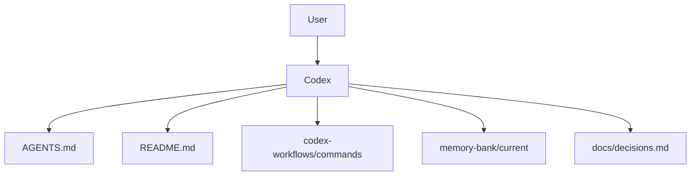

# System Patterns

## 架構總覽

本專案採用文件型協作架構。



## 核心模式

### 1. Single Instruction Entry

`AGENTS.md` 是 Codex 的主要規則入口。其他文件只能補充，不應與 `AGENTS.md` 衝突。

### 2. Command Documents Instead of Slash Commands

Codex 不使用 Cursor slash commands。每個工作模式改成一份 Markdown 命令文件，例如：

- `codex-workflows/commands/plan.md`
- `codex-workflows/commands/implement.md`
- `codex-workflows/commands/debug.md`

使用者透過自然語言要求 Codex 依文件執行。

### 3. Memory Bank as Shared State

`memory-bank/current/` 保存目前專案狀態。Codex 不應只依賴聊天上下文。

### 4. MVP-first Delivery

每次任務先做最小可用版本。重構、部署、自動化與外掛化都屬於後續階段。

### 5. Manual GC

完成一段工作後檢查 legacy、暫存檔、過時說明與未使用文件。

## 決策紀錄

重要決策寫入：

```text
docs/decisions.md
```

## 已移除的舊模式

- `.cursor/commands`
- `.cursor/rules`
- `.cursorrules`

原因：Codex 後續不使用這些 Cursor 專用入口。

